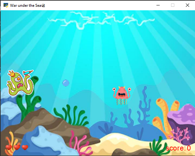

# War under the sea Game


## python

This project is written in Python version 3.10.8

I have used the [arcade](https://api.arcade.academy/en/latest/) library for this game





### **Usage**
---

First install arcade library
 ```
pip install arcade
 ```
 Then you can run the progaram.
  ```
monstergame.py
   ```

   

### **Game guide**
---
You should kill the Enemy Monsters under the sea

Press UP and DOWN keys to move your Monster

Press Space key to shoot to kill Enemy Monsters

If three Enemy Monsters can cross the screen,you will lose the game 


